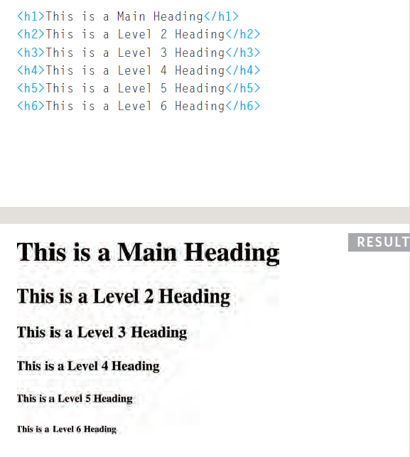
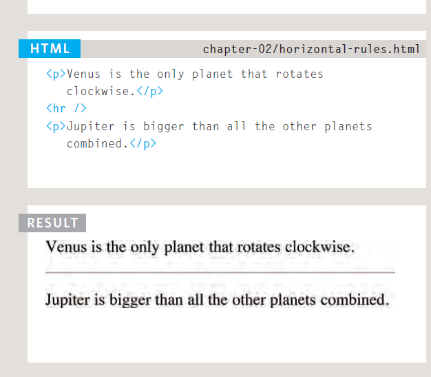
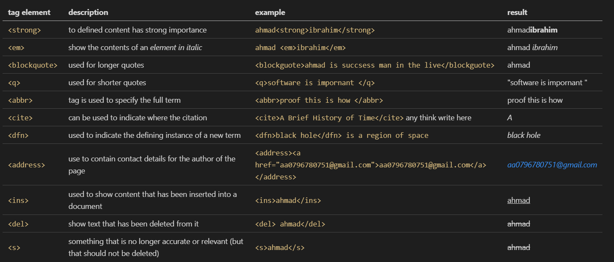
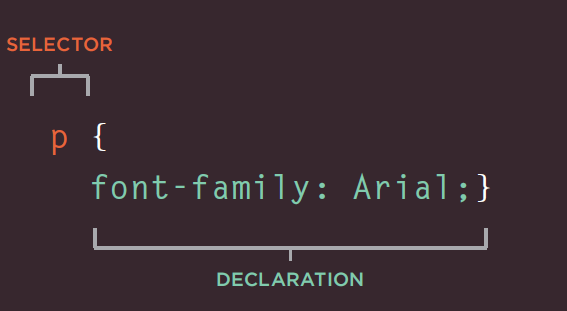
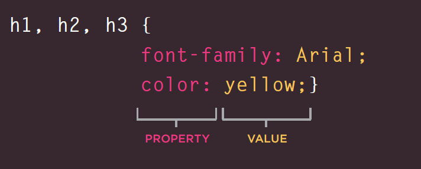
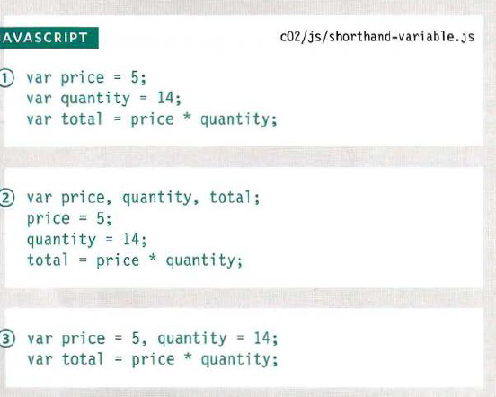
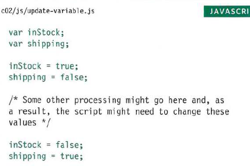
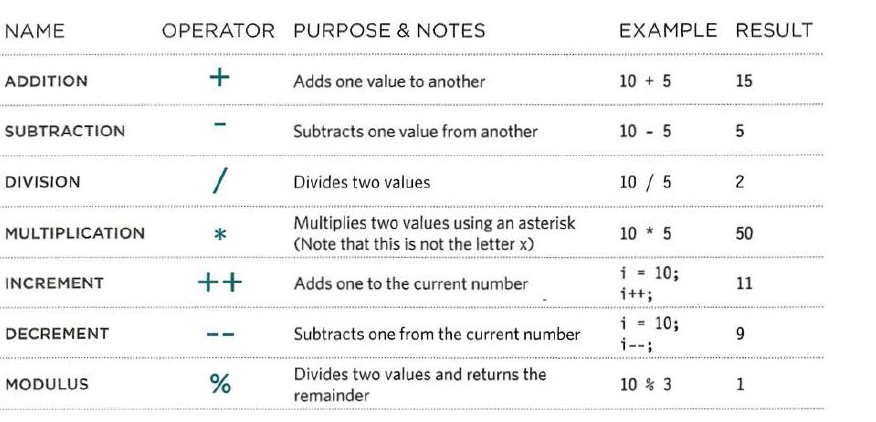

# HTML 
## Headings 
HTML has six "levels" of headings:

`<h1>` is used for main headings

`<h2>` is used for subheadings

## Paragraphs 
you can write any think in the paragraphs that make up the paragraph with an opening 
 tag and closing 
 tag.

### for example 

`
this chapter we will learn Html a bout text  
`

## Bold & Italic

`<b>`

to bold any text you must use `<b> any text you want bold</b>`
By enclosing words in the tags`<b> and </b>` we can make
characters appear bold.

`<i>`

By enclosing words in the tags`<i> and </i>` we can make
characters appear italic.

## Superscript & Subscript 
``

The` ` element is used  to contain characters that should be superscript ,to raise an exponential division or mathematical concepts like raising a number to a power such
as 22.

`` 

The`` element is used to contain characters that should be subscript. when need write some thing under line like H2O

## White Space
when use white space in the code , that is made the code is easy to read and reviwe for developer software  .

##  Line Breaks & Horizontal Rules
` ` that use when you want a add a line breack inside the middle of a pragraphs.

`
` 
To create a break between themes — such as a change of topic in a book or a new scene in a play — you can add a horizontal rule between sections using the `
` tag.

### for example 

# Semantic Markup
|tag element |        description                           |              example          |               result                 |
|------------|----------------------------------------------|-------------------------------|--------------------------------------|
|`<strong>`  |to defined content has strong importance      | `ahmad<strong>ibrahim</strong>`| ahmad<strong>ibrahim</strong>|
|`<em>`      |show the contents of an <em> element in italic | `ahmad <em>ibrahim</em>`  | ahmad <em>ibrahim<em> |                     
|`<blockquote>` |used for longer quotes  | `<blockguote>ahmad is succsess man in the live</blockguote>`|<blockguote>ahmad</blockguote> |
|`<q>`       | used for shorter quotes  | `<q>software is impornant </q>`|<q>software is impornant </q>|
|`<abbr>`    |tag is used to specify the full term  | `<abbr>proof this is how </abbr>`|<abbr>proof this is how </abbr>|
|`<cite>`    | can be used to indicate where the citation| `<cite>A Brief History of Time</cite>` any think write here|<cite>A </cite> |
|`<dfn>`     |used to indicate the defining instance of a new term| `<dfn>black hole</dfn> is a region of space`|<dfn>black hole</dfn>|
|`<address>` | use to contain contact details for the author of the page|`<address><a href="aa0796780751@gmail.com">aa0796780751@gmail.com</a> </address>`|<address><a href="aa0796780751@gmail.com">aa0796780751@gmail.com</a> </address>|
|`<ins>`     |used to show content that has been inserted into a document |`<ins>ahmad</ins>`|<ins>ahmad</ins>|
|`<del>`     | show text that has been deleted from it|`<del> ahmad</del>` |<del>ahmad</del> |
|`<s>`       | something that is no longer accurate or relevant (but that should not be deleted) | `<s>ahmad</s>` |<s>ahmad</s> |

# CSS 
when can you want add brouder padding bacground-color you need to use CSS page you can not do al of these in HTML page 

A CSS rule contains two parts: a selector and a declaration.

CSS declarations sit inside curly brackets and each is made up of two parts: a property and a value .

# External CSS
how can I using exernal css 

## `<link>`
can be used in an HTML document to tell the browser where to find the CSS file used to style the page. It should use three attributes

 1-href

This specifies the path to the
CSS file (which is often placed in
a folder called css or styles).

2- type

This attribute specifies the type
of document being linked to. The
value should be text/css.

3- rel

This specifies the relationship
between the HTML page and
the file it is linked to. The value
should be stylesheet when
linking to a CSS file

# internal css 

you can use HTML to edit about some thing in CSS by add in head 

`<<style> `
{

}
`</style >`

# type of selctor

|type selector |           desecription     |     example       |
|--------------|----------------------------|-------------------|
| Universal Selector|Applies to all elements in the document| * {} |
|Type Selector | Matches element names |h1,p,h2 {} |
|class selector | Matches an element whose class attribute has a value| .ahmad{}|
|ID selector |Matches an element whose id attribute has a value|#ahmad {}|
|Child Selector|Matches an element that is a direct child of another|li>a {}|
|Descendant Selector|Matches an element that is a descendent of another|p a {}|
|Adjacent Sibling Selector|Matches an element that is the next sibling of another|h1+p {}|
|General Sibling Selector|Matches an element that is a sibling of another, although itdoes not have to be the directly preceding element|h1~p {}|

# Inheritance 

If you specify the font-family
or color properties on the
`<body>` element, they will apply
to most child elements. This is
because the value of the
font-family property is
inherited by child elements. It
saves you from having to apply
these properties to as many
elements (and results in simpler
style sheets).

## example 

# Why use External Style Sheets?
when make a servel page in your website , you need same style ,All of your web pages can share
the same style sheet.

# use css in HTML page 
when we have single page . 

# javascript 

A script is a series of instructions that a computer can follow one-by-one. Each individual instruction or step is known as a statement. Statements should end with a semicolon.

## comments 
you shoud write commen to explain what your code does , that help to read easy and understand .

 we have to comment : 

 1- single line :will help you if you come back to your code after several days or months 

 /* here you can write any comment to explain  about your code */

 2-multi-line : descriptions of how the script works.

 //here you can write any comment 

## variable

 when we need to temporarily store to save information we need a variable 

 A variable is a good name for this concept because the data stored in a variable can change (or vary) each time a script runs.

 when creat a variable we need giving it a name , that mean for programming declare variable .

 the value of a variable content :1- number 2-string 3-baolean.. whaen creat variable you should write value veriable .

 1- numder data type :involve counting or calculating sums for example 5*9

 2- string :consists of letters and other characters foe example ('a,b')

 3- boolean : can have one of two values: true or false.

## when you want use value variable number you can write without single cotashen for example :

var width= 2 ;

var depth= 5;

var area= wideth *depth ; 

## when you want use value variable string you shoud write with single cotashen for example :

var username = 'ahmad' ;
var massege  = 'you good man ';
document.write(username , massege ) ;

### USING A VARIABLE TO STORE A BOOLEAN
A Boolean variable can only have a value of true or fa 1 se, but this data type is very helpful.

### SHORTHAND FOR CREATING VARIABLES

Programmers sometimes use shorthand to create variables. Here are three variations of how to declare variables:

1-Variables are declared and values assigned in the same statement.

2-Three variables are declared on the same line, then values assigned to each.

3-Two variables are declared and assigned values on the same line. Then one is declared andassigned a value on the next line.

### CHANGING THE VALUE OF A VARIABLE

Once you have assigned a valueto a variable, you can then  change what is stored in the variable later in the same script

## RULES FOR NAMING VARIABLES

1- The name must begin with a letter, dollar sign ($),or an underscore (_). It must not start with a number. 
2- that you must not use a dash(-) or a period (.) in a variable name 
3-You cannot use keywords or reserved word  
4-All variables are case sensitive, so score and Score would be different variable names. 
5-Use a name that describes the kind of information that the variable stores. 
6-If your variable name is made up of more than one word, use a capital letter for the first letter of every word after the first word. 

# ARRAYS  
An array is a special type of variable. It doesn't
just store one value; it stores a list of values. 
Arrays are especially helpful
when you do not know how
many items a list will contain
because, when you create the
array, you do not need to specify
how many values it will hold

## VALUES IN ARRAYS

Values in an array are accessed as if they are in
a numbered list. It is important to know that the
numbering of this list starts at zero (not one).

# EXPRESSIONS 
An expression evaluates into (results in) a single value. Broadly speaking
there are two types of expressions 
1-EXPRESSIONS THAT JUST ASSIGN A
VALUE TO A VARIABLE 
var color = blue ; 
2-EXPRESSIONS THAT USE TWO OR
MORE VALUES TO RETURN A
SINGLE VALUE 
var area= 2*3 ;

# OPERATORS
1-ASSIGNMENT OPERATORS  
color = 'beige' ; 
2-ARITHMETIC OPERATORS 
area = 3 * 2 ; 
3-STRING OPERATORS  
greeting= 'Hi 1 + 'Mol ly'; 

## ARITHMETIC OPERATORS

## STRING OPERATOR
There is just one string operator: the+ symbol.
It is used to join the strings on either side of it. 
For example, you might have a first and last name in two separate
variables and want to join them to show a full name. In this example, the
variable called full Name would hold the string 'Ivy Stone'. 
var firstName = 'ahmad ' ; 
var lastName = ' arman' ; 
var ful l Name = f irstName + l astName; 

# deciosn and loop 

