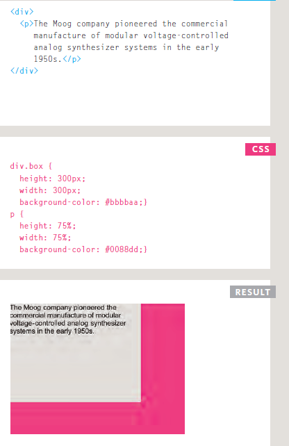
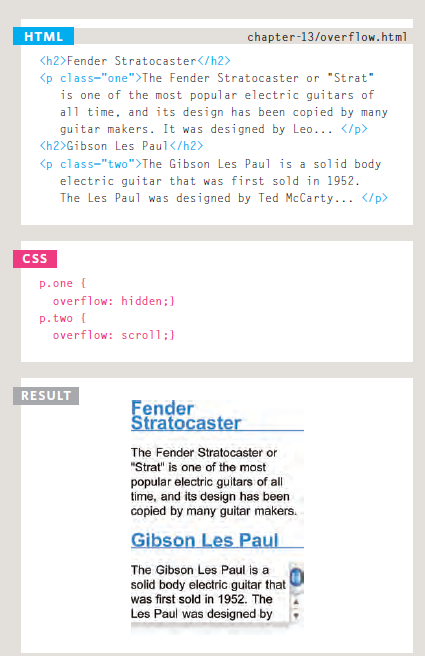
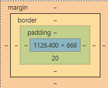
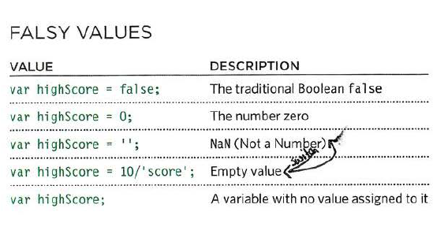

# HTML 
## LIST 
when we need to make in our page lists we have three different type .<br>
1-<b> order list </b>: ordered list is created with the `<ol>` element that use when you want show list as a number , Each item in the list is placed between an opening` <li>` tag and a closing `</li`> tag.<br>
## for exmple 
```
<ol>
   <li>
    ahmad 
   </li>
   <li>
    mohmad
   </li>
</ol>
```

## Ruselt 
<ol>
   <li>
    ahmad 
   </li>
   <li>
    mohmad
   </li>
</ol>

2- <b>unorder list </b>: unordered list is created with the `<ul>` element that use when you want show the list as points ,Each item in the list is placedbetween an opening `<li> `tagand a closing `</li>` tag.
## for exmple 
```
<ul>
   <li>
    ahmad 
   </li>
   <li>
    mohmad
   </li>
</ul>
```
## Ruselt 
<ul>
   <li>
    ahmad 
   </li>
   <li>
    mohmad
   </li>
</ul>

3-<b> definition list </b>: The definition list is created with the `<dl>` element and usually consists of a series of terms and their definitions,Inside the `<dl>` element you will usually see pairs of `<dt>` and `<dd>` elements.<br>
a- `<dt> ` : the definition term.<br>
b- `<dd>`  : used to contain the definition.<br>
## for exmple 
```
<d1>
<dt>AHMAD </dt>
<dd> ahmad he is a good man , he is 23 years old , he was born in jordan </dd>

</d1>
```
## Ruselt 
<d1>
<dt>AHMAD </dt>
<dd> ahmad he is a good man , he is 23 years old , he was born in jordan </dd>
</d1>

# note : { nested list }
You can put a second list inside an` <li>` element to create a sublist or nested list.<br>
## for exmple 
```
<ul> 
  <li>Software
     <ul>
       <li>html
       </li>
     </ul>
  </li>
</ul>
``` 
## Ruselt 

<ul> 
  <li>Software
     <ul>
       <li>html
       </li>
     </ul>
  </li>
</ul>

-----------------------------------------------------------------------------
# CSS 
## boxe
do not ask your self how can I made box for h1 or paragraph now we learn about box <br>
1- <b>box dimensions</b>: you  can change diemensions box by defined number for width and height<br>



2-<b>Limiting Width/height min-width/height, max-width/height</b>:  to defined the max ,min width or height  as you like .<br>

3- <b>Overflowing Content</b>:  The overflow property tells the browser what to do if the content contained within a box is larger than the box itself. we have to type :<br>
a-<i> hidden</i> :This property simply hides any extra content that does not fit in the box.<br>
b-<i>scroll</i> This property adds a scrollbar to the box so that users can scroll to see the missing content.<br>
## exmple 


## Border,Margin & Padding
every boxes you have three properties that can be adjusted to control its appearance:<br>
1-border :Every box has a border and auto. border box  = 0px you need to change <br>
2-padding :Padding is the space between the border of a box and any content contained within it.  <br>
3-margin : Margins sit outside the edge of the border.




## Border Width 
The border-width property is used to control the width of a border. using one of the following values: thin , medium , thick
You can control the individual size of borders using four separate properties:<br>
border-top-width<br>
border-right-width<br>
border-bottom-width<br>
border-left-width<br>

## Border Style

You can control the style of a border using the border-style property. This property can take the following values: p.one {border-style: solid;} we have many type : <br>
1-soild <br>
2-dotted<br>
3-dashed<br>
....atc...

## Border Color
 It is possible to individually control the colors of the borders on different sides of a box using:

border-top-color<br>
border-right-color<br>
border-bottom-color<br>
border-left-color<br>
 It is also possible to use ashorthand to control all four colors in the one property:<br>
  `border-color:2%,solid,red :`<br>
 The border property allows you to specify the width, style and color of a border in one property

## PADDING
The padding property allows you to specify how much space should appear between the content of an element and its border.<br>
we can change any direction padding you want chang like that :<br>
1- padding-top<br>
2- padding-right<br>
3- padding-bottom<br>
4- padding-left<br>

## MARGIN
The margin property controls the gap between boxes. Its value is commonly given in pixels, although you may also use percentages or ems.<br>
You can specify values for each side of a box using:<br>
margin-top<br>
margin-right<br>
margin-bottom<br>
margin-left<br>

------------------------------------------------------------------------------------

# Arrays
when you do not know how many items a list will contain because, when you create the array, you do not need to specify how many values it will hold, that is meain a list of value .<br>
1- You create an array and give it a name just like you would any other variable (using the var keyword followed by the name of the array)<br> 
2- The values are assigned to the array inside a pair of square brackets, and each value is separated by a comma.<br>
3-Values in an array are accessed as if they are in a numbered list. It is important to know that the numbering of this list starts at zero (not one)<br>


# if Conditional Statements

use if condition when you need to go two way every way apply different of other way .

# switch stetment 
  switch statement starts with a variable called the switch value. Each case indicates a possible value for this variable and the code that should run if the variable matches that value<br>
  The switch statement is used to perform different actions based on different conditions<br>


# TRUTHY & FALSY VALUES
 <b>Falsy</b>: values are treated as if they are fa1se.<br>
 <b> Truthy </b>: values are treated as if they are true</br>

 


# loop 
check condition ,if it the result is true , the code is run , then chcek one more if result is true will the code is run , it reapet until the condition result is false <br>
## Ther are three comment type of loops :
1-for : when need to run the code number of time 

2-while : when you do not knew how many time the code should run .

3-do while : that same while but different ,it always run the stetment inside the curly bracts


 
