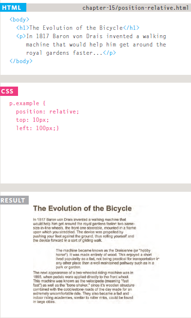
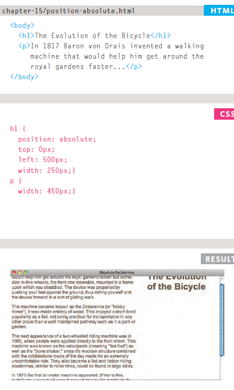
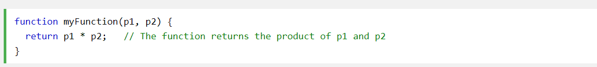
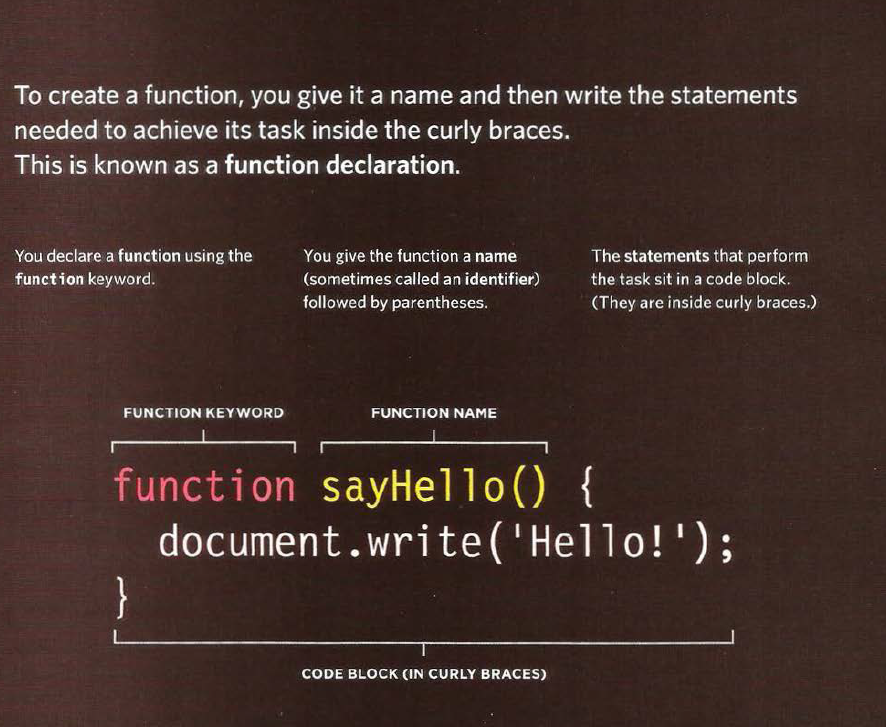
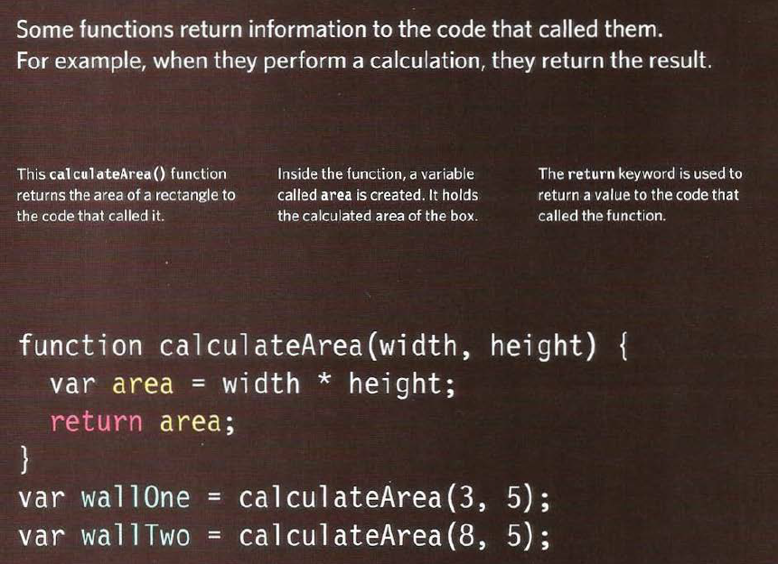

# HTML 
# link 
## creat link 
Links are created using the `<a>` element. Users can click on anything
between the opening `<a>` tag and the closing `</a>` tag
### example 
`<a href="http://www.gogle.com">google</a>`  
## Linking to Other Pages on the Same Site 
When you are linking to other pages within the same site, you do not need to specify the domain name in the URL. You can use a shorthand known as a relative URL. 
### example 
`<a href="201/class-03.md">class-03</a>`  
## Relative URLs
Relative URLs can be used when linking to pages within your own website. They provide a shorthand way of telling the browser where to find your files. 
## Email Links 
mailto:  To create a link that starts up the user's email program and addresses an email to a specified email address, you use the `<a> `element. 
### example 
`<a href="mailto:aa0796780751@gmail.com">email ahmad </a>`

### resulst 

<a href="mailto:aa0796780751@gmail.com">email ahmad </a>  

## Opening Links in a New Window
<b>target</b> 
If you want a link to open in a new window, you can use the target attribute on the opening `<a>` tag. The value of this
attribute should be _blank.

### example 
`<a href="http://www.google.com" target="_blank">Google</a>`

### result 
<a href="http://www.google.com" target="_blank">Google</a>

## Linking to a Specific Part of the Same Page 

At the top of a long page you might want to add a list of contents that links to the corresponding sections lower down. Or you might want to add a link from part way down the page back to the top of it to save users from having to scroll back to the top.

Before you can link to a specific part of a page, you need to identify the points in the page that the link will go to. You do this using the id attribute (which can be used on every HTML element). You can see that the `<h1>` and` <h2>` elements in this example have been given id attributes that identify those sections of the page.

--------------------------------------------------------------------------

 

# css 
# layout 
### Building Blocks
CSS treats each HTML element as if it is in its own box. This box will either be a block-level box or an inline box.

### Containing Elements
If one block-level element sits inside another block-level element then the outer box is known as the containing or parent element.

### Controlling the Position of elements
CSS has the following positioning schemes that allow you to control the layout of a page:

1- normal flow :`position:static`  each block-level element sits on top of the next one, Since this is the default way in which browsers treat HTML elements,, do not have width proprety for heading,,paragraphs are restricted to 450 pixels wide. 

2- relative positioning `position:relative` : Relative positioning moves an element in relation to where it would have been in normal flow, You then use the offset properties (top or bottom and left or right) to indicate how far to move the element from where it would have been in normal flow. 

3- absolute positioning `position:absolute`: When the position property is given a value of absolute, the box is taken out of normal flow and no longer affects the position of other elements on the page. (They act like it is not there.), The box offset properties (top
or bottom and left or right) specify where the element should appear in relation to its containing element.  

4-Fixed Positioning `position:fixed` : Fixed positioning is a type of absolute positioning that requires the position property to have a value of fixed. 
5-overlapping Elements `z-index` : When you use relative, fixed, or absolute positioning, boxes can overlap. If boxes do overlap, the elements that appear later in the HTML code sit on top of those that are earlier in the page .

----------------------------------------------------------------------------------------
 

# Function 

 is similar to a procedure a set of statements that performs a task or calculates a value, but for a procedure to qualify as a function, it should take some input and return an output where there is some obvious relationship between the input and the output. To use a function, you must define it somewhere in the scope from which you wish to call it.

## A BASIC FUNCTION 

 

## declaring a function 

## Invoking a JavaScript Function
The code inside a function is not executed when the function is defined.

The code inside a function is executed when the function is invoked.

It is common to use the term "call a function" instead of "invoke a function".

## declaring a function that need information 

some function taht need some information like parameter ,
parameter act like a variables 

## for example 

## calling a function that need information 
when calling the function we need some information inside to enable the function work 

## for example 

## getting a single value out of function 

## function declaration  
A function declaration creates a function that you can ca ll later in your code. It is the type of function you have seen so far in this book ,these are known as named functions. 

## function expression 
A function with no name is called an anonymous function

##  immediately invoked function expression 
when put function inside variable  

##  variable scop
we have two variable  
1- locol variable : the variable inside function  
2-globl variable  : the variable outside function  

##  how memory & variables work
Global variables use more memory,The browser has to remember them for as long as the web page using them is loaded. Local variables are only remembered during the period of time that a function is being executed.

