# HTML 
## IMAGE 
## Adding Images 
`` 
 HTML to add an image into the page you need to use an `` element. 
 in side img tag you must add `<src>` This tells the browser where it can find the image file  
 and if you want can add inside img tag `<alt>` This provides a text description of the image which describes the image if you cannot see it. 
 and `<title>`You can also use the title attribute with the `` element to provide additional information about the image.

## example 
 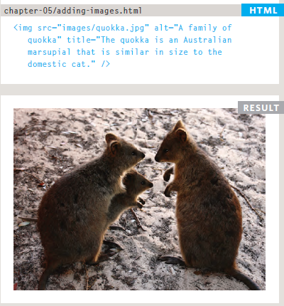 

##  Height & Width of Images
height :This specifies the height of the image in pixels. 
width :This specifies the width of the image in pixels. 

## Where to Place Images in Your Code
Where an image is placed in the code will affect how it is displayed. 
1: before a paragraph: The paragraph starts on a new line after the image. 
2: inside the start of a paragraph : The first row of text aligns with the bottom of the image. 
3: in the middle of a paragraph :  The image is placed between the words of the paragraph that it appears in. 

## example 

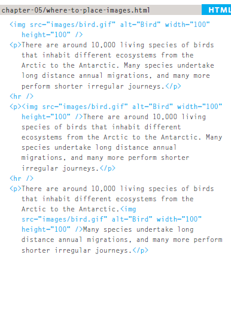 

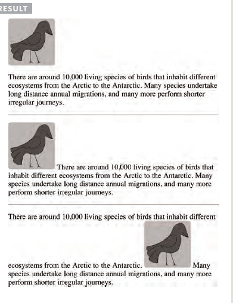  

## Aligning Images Horizontally
`<align>`  
use to move img to right or left `<align="left">`or `<align="right">`  

## example 

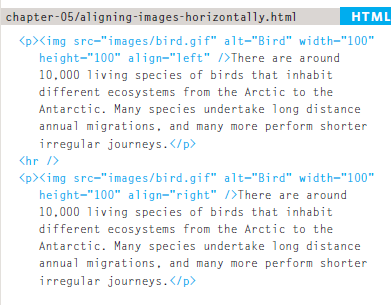 

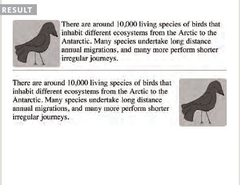 

## Aligning Images Vertically

use to move img to top or bottom or middle  `<align="top">`or `<align="middle">` or `<align="bottom">` 

## Figure and Figure Caption
`<figure>` :use to put images inside figure . 
`<figcabtion>` : use to put a caption to an image.

## example 

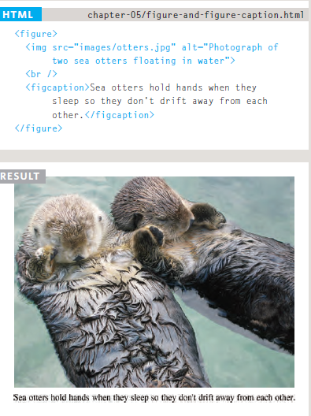

--------------------------------------------------------------------------------
## color 

## Foreground Color 
You can specify any color in CSS in one of three ways  
1-rgb values : rgb(100,100,90)
2-hex codes : #ee3e80
3-color names : DarkCyan

## Background Color
`<background-color>`
CSS treats each HTML element as if it appears in a box, and the background-color property sets the color of the background for that box.

## example 
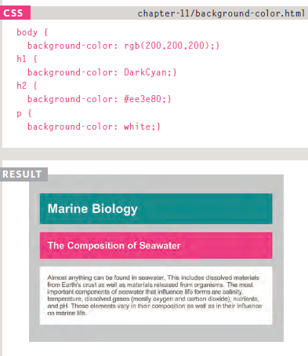

## Opacity
opacity, rgba
CSS3 introduces the opacity property which allows you to  specify the opacity of an element and any of its child elements.The value is a number between 0.0 and 1.0 (so a value of 0.5 is 50% opacity and 0.15 is 15% opacity). 

The CSS3 rgba property allows you to specify a color, just like you would with an RGB value, but adds a fourth value to indicate opacity. This value is known as an alpha value and is a number between 0.0 and 1.0(so a value of 0.5 is 50% opacity
and 0.15 is 15% opacity). The rgba value will only affect the element on which it is applied (not child elements). 

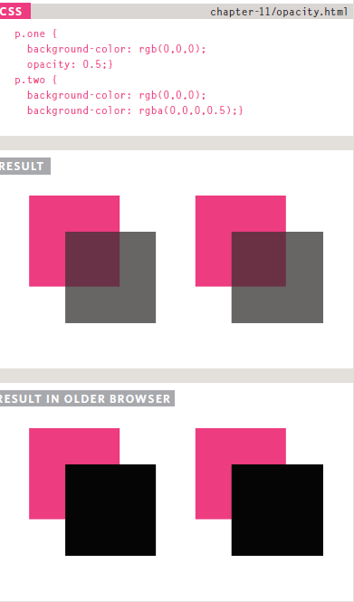

## HSL Colors
CSS3 introduces an entirely new and intuitive way to specify colors using hue, saturation, and lightness values.

`<hsl>`, `<hsla>`  
<b>hue </b>: This is expressed as an angle (between 0 and 360 degrees). 
<b>saturation</b>: This is expressed as a percentage. 
<b>lightness</b>:  This is expressed as a percentage with 0% being white, 50% being normal, and 100% being black. 
The hsla color property allows you to specify color properties using hue, saturation, and lightness as above, and adds a fourth value which represents transparency (just like the rgba property). The a stands for: 
alpha :  This is expressed as a number between 0 and 1.0. For example, 0.5 represents 50% transparency, and 0.75 represents 75% transparency.

## example 
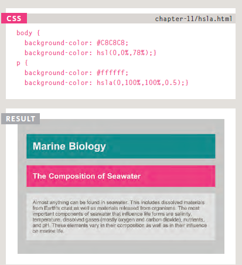

-----------------------------------------------------------------------------------
# CSS 
## Text 
## Typeface Terminology 

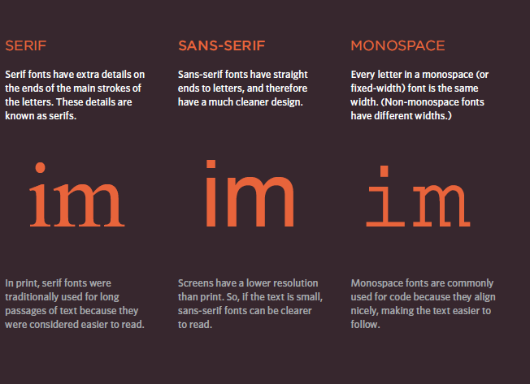

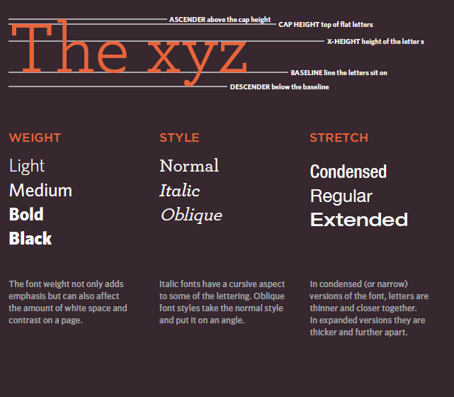

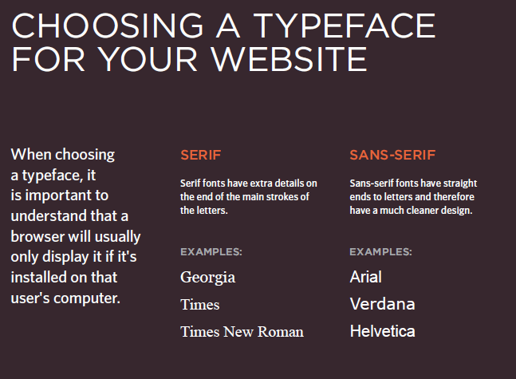

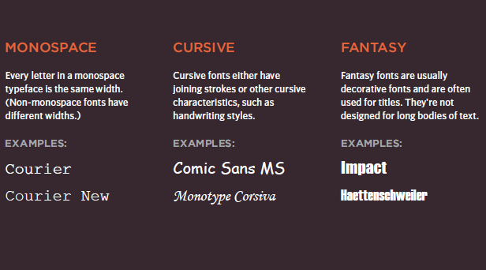

## Specifying Typefaces font-family
`<font-family>` 
The font-family property allows you to specify the typeface that should be used for any text inside the element(s) to which a CSS rule applies.  
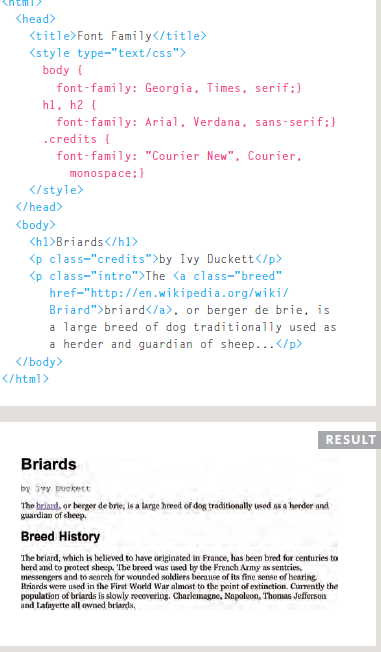

## Size of Type
`<font-size>`  
The font-size property enables you to specify a size for the font. There are several ways to specify the size of a font. The most common are: 
1-pixles :The number of pixels is followed by the letters px. 
2-percentages :The default size of text in browsers is 16px. So a size of 75% would be the equivalent of 12px, and 200% would be 32px 
3-ems:  An em is equivalent to the width of a letter m

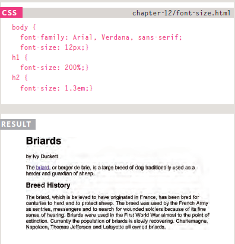

## Type Scales 
unit of type scales :  
1- pixles 
2- parsentage  
3- ems  
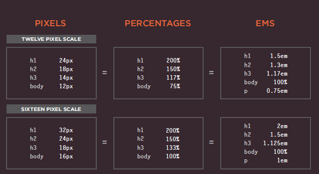

## More Font Choice 
## @font-face
use a font, even if it is not installed on the computer of the person browsing, by allowing you to specify a path to a copy of the font, which will be downloaded if it is not on the user's machine .

|     Type     |     desecrbtion        |                example                  |
|--------------|------------------------|-----------------------------------------|
| font-family  | to chang type of font  | `<font-family: Georgia, Times, serif>`  |
|  font-size   | to change size of font | `<font-size: 12px>``<font-size: 200%>`  |
|  @font-face  |use a font even if it is not installed on the computer |` <@font-face  src: url('fonts/chunkfive.eot')>` |
| font-weight  |    create bold text    | `<font-weight: bold> <font-weight: normal>` |
| font-style   |    create italic text  |`<font-style :italic>` |
|text-transform| change the case of text uppercase| `<text-transform:uppercase>` |
|text-transform| change the case of text lowercase| `<text-transform:lowercase>` |
|text-transform| change the case of text capitalize| `<text-transform:capitalize>` |
|text-decoration| put line whitout  line |`<text-decoration: none>` |
|text-decoration| put line put underline |`<text-decoration: underline>` |
|  line-height  | space height |`<line-height:1.4 em >`|
|letter-spacing | space between letter |`<letter-spacing:1em>` |
|  word-spacing | space between word   |`<word-spacing:0.2>`   |
|   text-align  | allows you to control the alignment of text | `<text-align:left ><text-align: right>` |
|vertical-align | vertical align |`<vertical-align :text-top>` `<vertical-align:text-bottom>`|
|  text-indent  |allows you to indent the first line of text within an element | `<text-indent:20px>` |
|  text-shadow  |used to create a drop shadow |`<text-shadow: -1px -1px #666666>`|
| first-letter  |deffined first letter |`<first letter: font-size:200p% >` |
| first-line    | deffined first line  | `<first line  font weight : bold>` |
|     link      | allows you to set styles for links | `<link>`  |
|   visited     | allows you to set styles for links | `<visited>` |
|    hover      |when a user hovers over an element | `<hover>` |
|    active     |when an element is being activated| `<active>` |
|    focus      |when an element has focus | `<focus>` |

## Attribute Selectors 

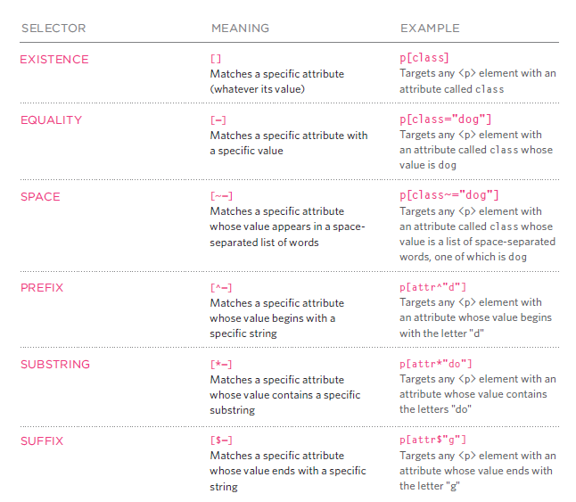

 

