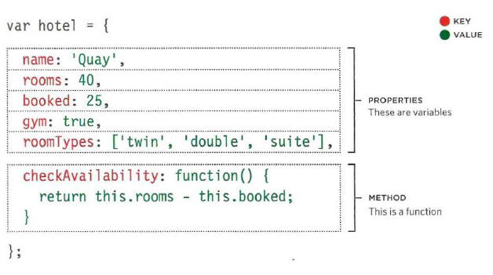
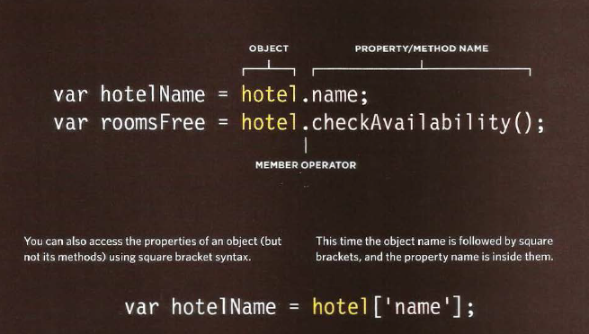
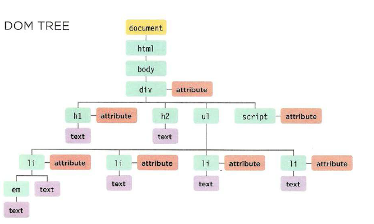
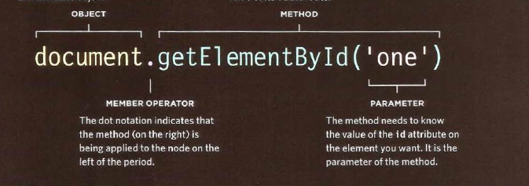

The problem domain its really the hardest part of programming .
If understanding the problem domain is the hardest part of programming and you want to make programming easier, you can do one of two things:

- Make the problem domain easier
- Get better at understanding the problem domain
# OPJECT 
a set of variables and functions to create a model of a something you would recognize from the real world. In an object, variables and functions take on new names. 
1- If a variable is part of an object, it is called a property. Properties tell us about the object, such as the name of a hotel or the number of rooms it has. 
2- If a function is part of an object, it is called a method. Methods represent tasks that are associated with the object. For example, you can check how many rooms are available by subtracting the number of booked rooms from the total number of rooms. 
## example 

# greating an object literal notation
literal notation : ther are several way to creat objects( easiest and most populer way to creat object )

# accessing an object and dot notation 
you access the properties or methods of an object using dot notation  
you can also access properties using square brackets. 

-------------------------------------------------------------------------------------

# THE DOM TREE IS A MODEL OF A WEB PAGE
The model is called a DOM tree, and it is stored in the browsers' memory. 
It consists of four main types of nodes. 

## DOM TREE 

## WORKING WITH THE DOM TREE
Accessing and updating the DOM tree involves two steps: 
1: Locate the node that represents the element you want to work with. 
2: Use its text content, child elements, and attributes. 

## ACCESSING ELEMENTS
DOM queries may return one element, or they may return a Nodelist, which is a collection of nodes. 

## METHODS THAT RETURN A SINGLE ELEMENT NODE
1-`<getElementByld('id')>`  : allows you to select a single element node by specifying the value of its id attribute. 
2-`<querySel ector ('css selector')>` 

## METHODS THAT RETURN ONE OR MORE ELEMENTS 
1-`<getElement sByClassName('class')>` 
2-`<getElementsByTagName(tagName)>` 
3-`<querySelectorAll ('css selector')>` 

## method of select individul element 
getElemntById() and QuerySelector()can both search an entire document and return individul element 

## NODELISTS: DOM QUERIES THAT RETURN MORE THAN ONE ELEMENT
When a DOM method can return more than one element, it returns a Nodelist (even if it only finds one matching element). 

## selecting an element from a nodelist
we have two way to select an element from a nodelist : 
1-the item ()method , which will return an individual node from the Nodelis 
2- array syntax is preferred over item method because  
## repeating action for an entire nodelist 
you can loop through  each node in the collection and apply the same statement to each  

## TRAVERSING THE DOM
When you have an element node, you can select another element in relation to it using these five properties. This is known as traversing the DOM. 
## WHITESPACE NODES
Traversing the DOM can be difficult because some browsers add a text node whenever they come across whitespace between elements> 

