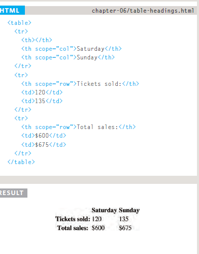

# HTML
## Table 
wehen want creat table in html you need to `<table>` tag : 
The contents of the table are written out row by row . 
`<tr>`  
You indicate the start of each row using the opening `<tr>` tag. (The tr stands for table row.) 
It is followed by one or more `<td>` elements (one for each cell in that row).  
At the end of the row you use a closing `</tr> `tag. 
`<td>`: 
Each cell of a table is represented using a `<td>` element. (The td stands for table data.) At the end of each cell you use a closing `</td>` tag.

## example 

 

## Table Headings
`<th>`  
The <th> element is used just like the <td> element but its purpose is to represent the heading for either a column or a row. (The th stands for table heading.)  

 

## Spanning ColumnS 
The colspan attribute can be used on a `<th>` or `<td>` element and indicates how many columns that cell should run across. 

## Spanning Rows 
The rowspan attribute can be used on a `<th>` or `<td>` element to indicate how many rows a cell should span down the table.

## Long Tables 
when you need print long table , you must these tag `<threat>` to put main title in table , `<tbody>` to put evey value you want inside the table and `<tfoot>` to put footer in the table  

 

## Result 

## Width & Spacing 

The width attribute was used on the opening `<table>` tag to indicate how wide that table should be and on some opening `<th>` and `<td>` tags to specify the width of individual cells. The value of this attribute is the width of the table or cell in pixels.

## Border & Background 
The border attribute was used on both the `<table>` and `<td>` elements to indicate the width of the border in pixels.

## example 

------------------------------------------------------------------------

# JavaScript 

# greating an object literal notation
literal notation : ther are several way to creat objects( easiest and most populer way to creat object )

## Updating an object 

# accessing an object and dot notation 
you access the properties or methods of an object using dot notation  
you can also access properties using square brackets. 

## RECAP: WAYS TO CREATE OBJECTS

## THIS (IT IS A KEYWORD)
The keyword this is commonly used inside functions and objects. Where the function is declared alters what this means. It always refers to one object, usually the object in which the function operates.

## Array in object 

## GLOBAL OBJECTS:
### MATH OBJECT

