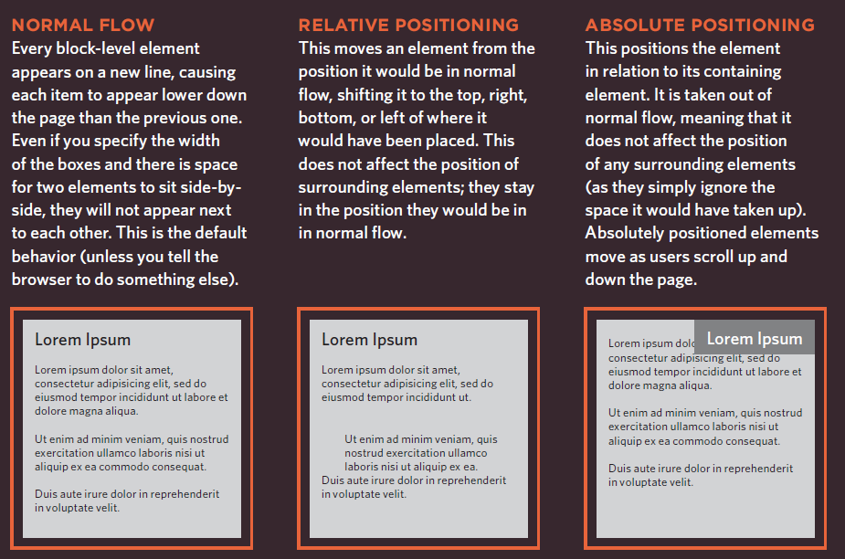
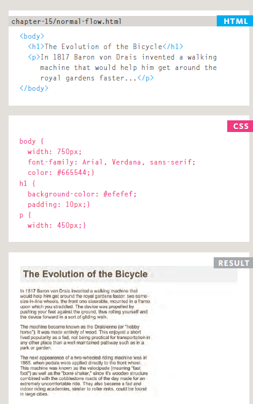
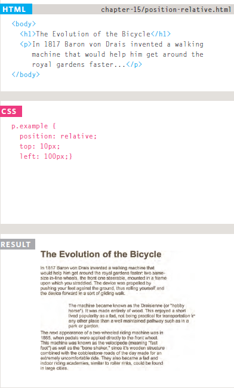
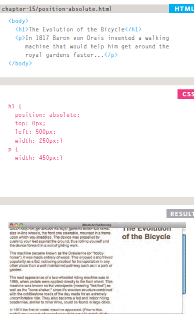

# css 
# layout 
### Building Blocks
CSS treats each HTML element as if it is in its own box. This box will either be a block-level box or an inline box.

### Containing Elements
If one block-level element sits inside another block-level element then the outer box is known as the containing or parent element.

### Controlling the Position of elements
CSS has the following positioning schemes that allow you to control the layout of a page:

1- normal flow :`position:static`  each block-level element sits on top of the next one, Since this is the default way in which browsers treat HTML elements,, do not have width proprety for heading,,paragraphs are restricted to 450 pixels wide. 

2- relative positioning `position:relative` : Relative positioning moves an element in relation to where it would have been in normal flow, You then use the offset properties (top or bottom and left or right) to indicate how far to move the element from where it would have been in normal flow. 

3- absolute positioning `position:absolute`: When the position property is given a value of absolute, the box is taken out of normal flow and no longer affects the position of other elements on the page. (They act like it is not there.), The box offset properties (top
or bottom and left or right) specify where the element should appear in relation to its containing element.  

4-Fixed Positioning `position:fixed` : Fixed positioning is a type of absolute positioning that requires the position property to have a value of fixed. 
5-overlapping Elements `z-index` : When you use relative, fixed, or absolute positioning, boxes can overlap. If boxes do overlap, the elements that appear later in the HTML code sit on top of those that are earlier in the page .

## Screen Resolution 
Resolution refers to the number of dots a screen shows per inch. Some devices have a higher resolution than desktop computers and most
operating systems allow users to adjust the resolution of their screens

## Page Sizes
Because screen sizes and display resolutions vary so much, web
designers often try to create pages of around 960-1000 pixels wide
(since most users will be able to see designs this wide on their screens).

## Fixed Width Layouts 

Fixed width layout designs do not change size as the user increases or decreases the size of their browser window. Measurements tend to be given in pixels.

## Liquid Layouts 
Liquid layout designs stretch and contract as the user increases or decreases the size of their browser window. They tend to use percentages.

