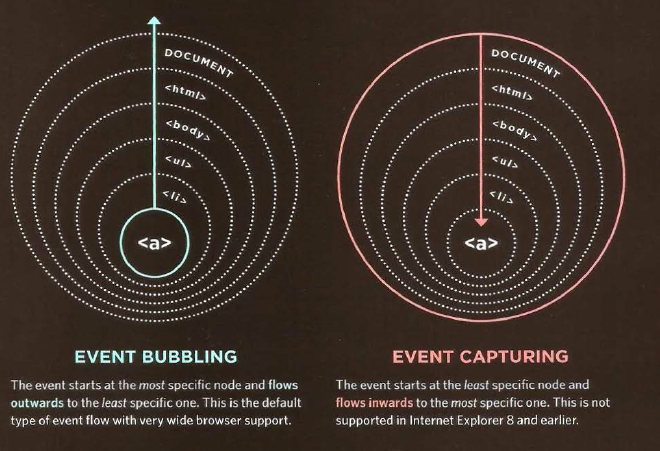

# How Forms Work 
1-A user fills in a form and then presses a button to submit the information to the server.  
2-The name of each form control is sent to the server along with the value the user enters or selects. 
3-The server processes the information using a programming language such as PHP, C#, VB.net, or Java. It may also store the information in a database. 
4- The server creates a new page to send back to the browser based on the information received  
 
 

## Form Structure

<`form>` 
Form controls live inside a `<form>` element. This element should always carry the action attribute and will usually have a method and id attribute too. 
`<action>` 
Every `<form>` element requires an action attribute. Its value is the URL for the page on the server that will receive the information in the form when it is submitted. 

## Text Input

`<input>` 
The `<input>` element is used to create several different form controls. The value of the type attribute determines what kind of input they will be creating. 
type="text" 
When the type attribute has a value of text, it creates a singleline text input.  

## Password Input 

`<input>` 
type="password" 
When the type attribute has a value of password it creates a text box that acts just like a single-line text input 

-------------------------------------------------------------

# list 
## Images for bullets 
1- `<list-style-image>`   
  

2-`<list-style-position>`  
  

3-`<list-style>`  
  

4- table properties  
 

  

----------------------------------------------------------

# event folow

## why folow matters 
the folow of event only really matters when your code has event  

## wher event accur
the event object can tell you where the cursor was positioned when an event was triggered

