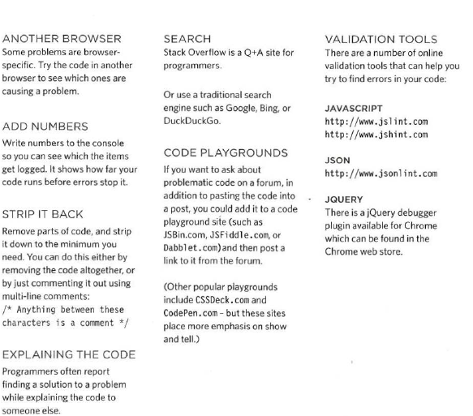

# Stake 
 a stack is a list of elements that are accessible only from one end of the list, which is called the Top of Stack (ToS).  

   

  

## EXECUTION CONTEXT & HOISTING
 Each time a script enters a new execution context, there are two phases of activity: 
 1-  PREPARE  
• The new scope is created  
• Variables, functions, and arguments are created  
• The value of the this keyword is determined  

2-  EXECUTE  
• Now it can assign values to variables  
• Reference functions and run their code 
• Execute statements 

## UNDERSTANDING SCOPE

In the interpreter, each execution context has its own va ri ables object. It holds the variables, functions, and parameters available within it. Each execution context can also access its parent's v a ri ables object.  

## UNDERSTANDING ERRORS 
If a JavaScript statement generates an error, then it throws an exception. At that point, the interpreter stops and looks for exception-handling code.   

## ERROR OBJECTS 
Error objects can help you find where your mistakes are and browsers have tools to help you read them.  
  

## ERROR OBJECTS CONTINUED
  
  

  
  

## DEBUGGER KEYWORD
You can create a breakpoint in your code using just the debugger keyword. When the developer tools are open, this will automatically create a breakpoint.  
You can also place the debugger keyword within a conditional statement so that it only triggers the breakpoint if the condition is met. This is demonstrated in the code below.  
It is particularly important to remember to remove these statements before your code goes live as this could stop the page running if a user has developer tools open. 

## DEBUGGING TIPS
Here are a selection of practical tips that you can try to use when debugging your scripts.   

