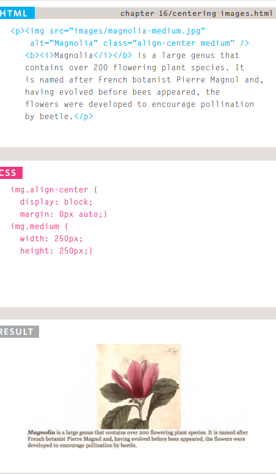

# image 
## contral size picture 
you can control size picture by defined width and height propertiy in css 

## Centering images Using Css 

## Background Images background-image 
The background-image property allows you to place an image behind any HTML element.

## Repeating Images
 background-repeat  
 background-attachment  
 repeat  
The background image is repeated both horizontally and vertically.

## Background Position 
`<background-position >` : to define position  image in page body 
1- left right  
2-left top  
3-center left  
4-bottom tight  

------------------------------------------------------------------------------ 
## How Many People Are Coming to Your Site?
The overview page gives you a snapshot of the key information you are likely to want to know. In particular, it tells you how many people are coming to your site.

## What Are Your Visitors Looking At?
The content link on the left-hand side allows you to learn more about what the visitors are looking at when they come to your site.

## Where Are Your Visitors Coming From?
The traffic sources link on the left hand side allows you to learn where your visitors are coming from. 

------------------------------------------------------------------------------
## Timeline: Flash, VidEo & Audio
Web technologies change quickly. Here you can see some of the changes in how animation, video, and audio are created on the web.

