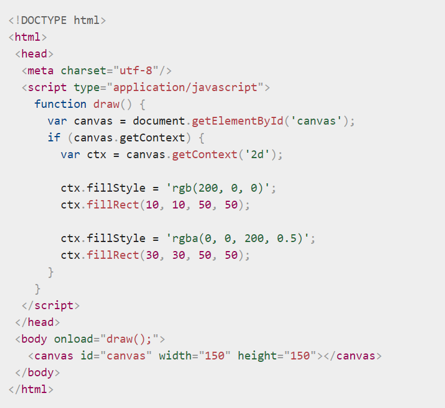
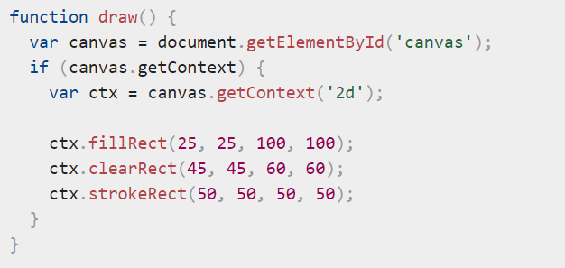
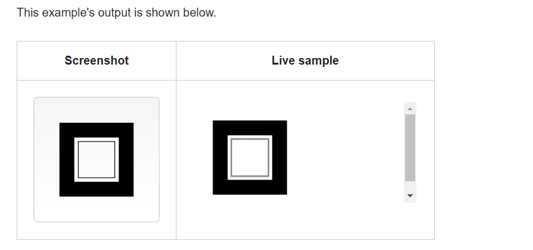
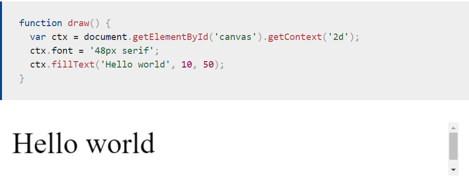

# Chart.js
Chart.js can be used with ES6 modules, plain JavaScript and module loaders.

## Chart type
The types of charts that you can use: 
1-Line 
2-Bar 
3-Radar 
4-Doughnut and Pie 
5-Polar area 
6-Bubble 
7-Scatter 

# The canvas element 

`<canvas id="tutorial" width="150" height="150"></canvas>` 
At first sight a `<canvas> `looks like the `` element, with the only clear difference being that it doesn't have the src and alt attributes. Indeed, the `<canvas>` element has only two attributes, width and height.

## Required canvas tag 
the `<canvas>` element requires the closing tag (`</canvas>`). If this tag is not present, the rest of the document would be considered the fallback content and wouldn't be displayed.

##  The rendering context

`var canvas = document.getElementById('tutorial');`  
`var ctx = canvas.getContext('2d');` 
The first line in the script retrieves the node in the DOM representing the` <canvas> `element by calling the document.getElementById() method. Once you have the element node, you can access the drawing context using its getContext() method.

## Checking for support 

The fallback content is displayed in browsers which do not support `<canvas>.` Scripts can also check for support programmatically by testing for the presence of the getContext() method.

`(var canvas = document.getElementById('tutorial');`

``if (canvas.getContext) {``
 `` var ctx = canvas.getContext('2d');``
 `` // drawing code here``
``} else {``
  ``// canvas-unsupported code here``
``})``

## Example 

## Rectangular shape example 

## Colors 
Up until now we have only seen methods of the drawing context. If we want to apply colors to a shape, there are two important properties we can use: fillStyle and strokeStyle.

fillStyle = color  
Sets the style used when filling shapes. 
strokeStyle = color 
Sets the style for shapes' outlines.  

for example :

ctx.fillStyle = 'orange';  
ctx.fillStyle = '#FFA500'; 
ctx.fillStyle = 'rgb(255, 165, 0)'; 
ctx.fillStyle = 'rgba(255, 165, 0, 1)'; 

## A fillText example
The text is filled using the current fillStyle.

## A strokeText example
The text is filled using the current strokeStyle.

