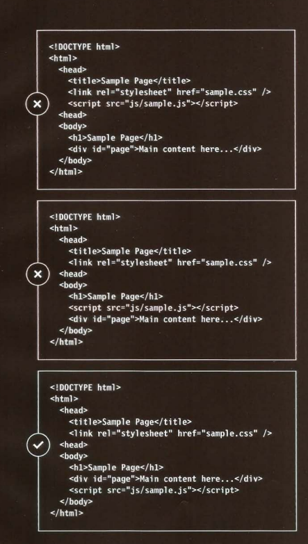

# jQuery 
 jQuery is a JavaScript library designed can you find element using css selectors ,then can do something for this element using jQuery method
### example 

`$(li.ahmad).addId('name')`

## Effect 

### BASIC EFFECTS

|  Method  |    Description     |
|-----------|-------------|
|  .show () |Displays selected elements|
|  .hide()  |  Hides selected elements |
| .togg1e() |  Toggles between showing and hiding selected elements  |

## How to use jQuery correct jQuery link 

  
  
 
 

## looping
we can use jquery to code more than item in one line

## chaining
you can use list several methods at in one a time using dot notation to separate each one 

### example 
$( 'li[i d!="one"]').hide().delay(SOO).fadeln(1400);

### updating elements
we can get it by

1)  .html()  
2)  .text()  
3)  .remove()  
4)  .replaceWith()  

###  Getting and setting attribute value 
1).attr()  
2).removeAttr()  
3).addClass()  
4).rempveClass()  

## pair programming 

### Why pair program? 

1. Greater efficiency  
2. Engaged collaboration  
3. Learning from fellow students  
4. Social skills  
5. Job interview readiness  
6. Work environment readiness  

