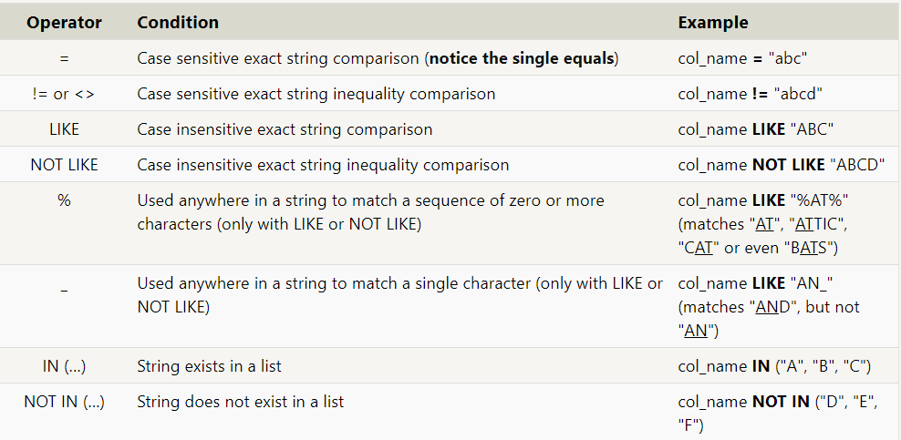

# What is SQL?

 SQL, or Structured Query Language, is a language designed to allow both technical and non-technical users query, manipulate, and transform data from a relational database. And due to its simplicity, SQL databases provide safe and scalable storage for millions of websites and mobile applications.


## SQL Lesson 1: SELECT queries 101
 To retrieve data from a SQL database, we need to write SELECT statements, which are often colloquially refered to as queries. A query in itself is just a statement which declares what data we are looking for, where to find it in the database, and optionally, how to transform it before it is returned. It has a specific syntax though, which is what we are going to learn in the following exercises.

    As we mentioned in the introduction, you can think of a table in SQL as a type of an entity (ie. Dogs), and each row in that table as a specific instance of that type (ie. A pug, a beagle, a different colored pug, etc). This means that the columns would then represent the common properties shared by all instances of that entity (ie. Color of fur, length of tail, etc).

```
  Select query for a specific columns
 SELECT column, another_column, …
 FROM mytable;
```

``` 
 Select query for all columns
 SELECT * 
 FROM mytable;
```

## SQL Lesson 2: Queries with constraints (Pt. 1)
 Now we know how to select for specific columns of data from a table, but if you had a table with a hundred million rows of data, reading through all the rows would be inefficient and perhaps even impossible.

```
  Select query with constraints
 SELECT column, another_column, …
 FROM mytable
 WHERE condition
    AND/OR another_condition
    AND/OR …;
```

# SQL Lesson 3: Queries with constraints (Pt. 2)
  When writing WHERE clauses with columns containing text data, SQL supports a number of useful operators to do things like case-insensitive string comparison and wildcard pattern matching. We show a few common text-data specific operators below:

  