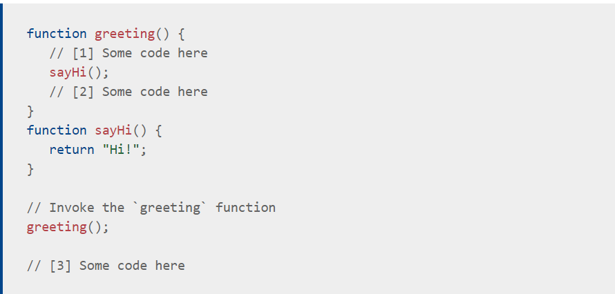

# Call stack 

 When a script calls a function, the interpreter adds it to the call stack and then starts carrying out the function.
 Any functions that are called by that function are added to the call stack further up, and run where their calls are reached.
 When the current function is finished, the interpreter takes it off the stack and resumes execution where it left off in the last code listing.
 If the stack takes up more space than it had assigned to it, it results in a "stack overflow" error.

 ;

 [reference](https://developer.mozilla.org/en-US/docs/Glossary/Call_stack)
 [reference](https://www.freecodecamp.org/news/understanding-the-javascript-call-stack-861e41ae61d4/)

# JavaScript error messages && debugging 

## Types of error messages 
* Reference errors  
   This is as simple as when you try to use a variable that is not yet declared you get this type os errors. 
   This is also a common thing when using const and let, they are hoisted like var and function but there is a time between the hoisting and being declared so when you try to access them a reference error occurs, the fact that this happens to let and const is called Temporal Dead Zone (TDZ).

* Syntax errors  
   I know it’s in the name of the errors, but like it says itself, this occurs when you have something that cannot be parsed in terms of syntax, like when you try to parse an invalid object using JSON.parse.

* Range errors  
  Try to manipulate an object with some kind of length and give it an invalid length and this kind of errors will show up.

* Type errors  
   Like the name indicates, this types of errors show up when the types (number, string and so on) you are trying to use or access are incompatible, like accessing a property in an undefined type of variable.    

### [Reference](https://codeburst.io/javascript-error-messages-debugging-d23f84f0ae7c)

[main page](https://ahmad-arman.github.io/reading_note/)