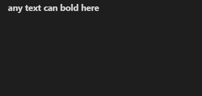
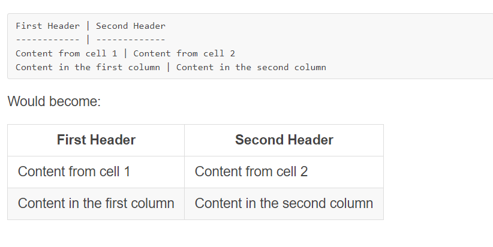

# markdown 

You do not ask yourself when open some web site on your computer or phone how can them work this  a web ? it is realy very hard to make up ? 
So the software is not hard as you hear but you need to practice then practice and some paitent 
So we talk is this part about help you a part (a piece ) of software that you able to make web site 
We talk a bout markdown program (visual studia code ) 

What is a markdown :

this program you can control in of thes  document,formatting words as bold or italic,adding images,creating lists and some thing else , And it contains some special icons like #,*,-,+ . And can you use markdown then download on GIitHub by creating a file in (.md)

## Examples :

### 1- bold :
  we can bold any text by adding **       **
   if write :

   `**any text can bold here**`  

### result : 
 
  

 ### 2-list : 

 if you want number list just write a number 

 1- 

 2-

if you want important point use :

`* start a line `

`* profile`

Alternatively we can use 

`- start a line` 

And when need sub point you can put two space then write dash or star  
                  

       - my work 
   
           - reading_note  
        
 
### result : 

if you want number list just write a number 

 1- 

 2-

if you want important point use :

* start a line 

* profile

Alternatively we can use 

- start a line

And when need sub point you can put two space then write dash or star  
                  

 - my work 
   
     - reading_note  

### 3-Image :

if you want add imag use : ``
 
 ### 4- Headers & Quotes

 if want add headers we have six different header we first header use

  `# first header` 

  `## second header` 

  `### third header` 

  `#### fourth header` 

  if you wamt quate put in the start line 

  `> any thing here appear as quote `

  ### result :
  # first header
  ## second header
  ### third header 
  #### fourth header 

  if you wamt quate put in the start line 

  > any thing here appear as quote 

### 5-  italic text 
you can italic text by add 

`*any text here is italic text*` 
 ### result :        
*any text here is italic text*

### 6- Links
 you can use link by add 

 [name link](url for it )

 `[GitHub](http://github.com)`
### result : 

 you can use link by add 

[GitHub](http://github.com)

### 7- Inline code
 you can use an

`<addr>` element here instead.
### 8- Syntax highlighting
### we can use `` you can write inside these icnor 
### 9- Task Lists 

### 10- Tables 
 can use to make a table by creat hyphen - and pipe :|

 ### example 
 
  
### 11- Username @mentions

Typing an @ symbol, followed by a username, will notify that person to come and view the comment. This is called an “@mention”

Strikethrough
Any word wrapped with two tildes (like ~~this~~) will appear crossed out. 

### 12- Strikethrough
Any word put with two tildes (like ~~this~~) will appear crossed out.

~~this~~
 

