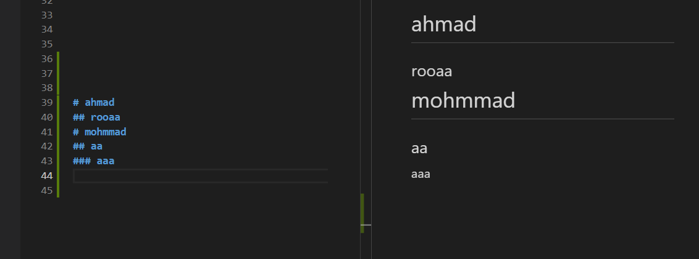
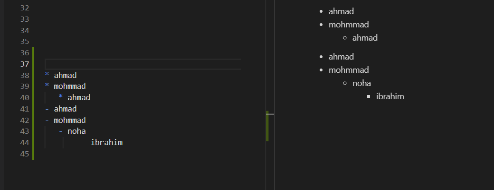
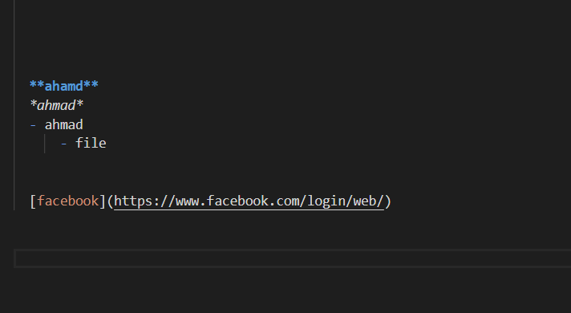
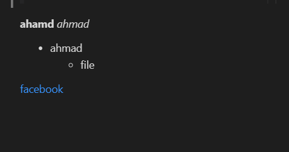

# markdown 

You do not ask yourself when open some web site on your computer or phone how can them work this  a web ? it is realy very hard to make up ? 
So the software is not hard as you hear but you need to practice then practice and some paitent 
So we talk is this part about help you a part (a piece ) of software that you able to make web site 
We talk a bout markdown program (visual studia code ) 

What is a markdown:

this program you can control in of thes  document,formatting words as bold or italic,adding images,creating lists and some thing else 

Let we talk some example in mark down: 

|           input     |              output         |
|           :---:     |              :---:          |
| |                          |

|                               |

|                               |

|                                |

