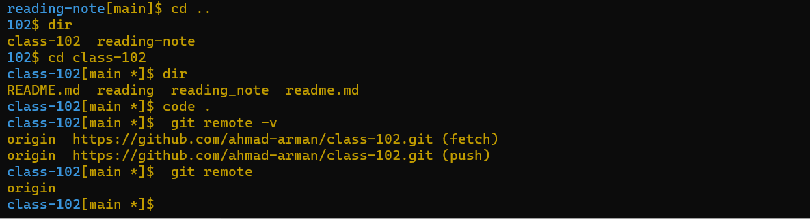
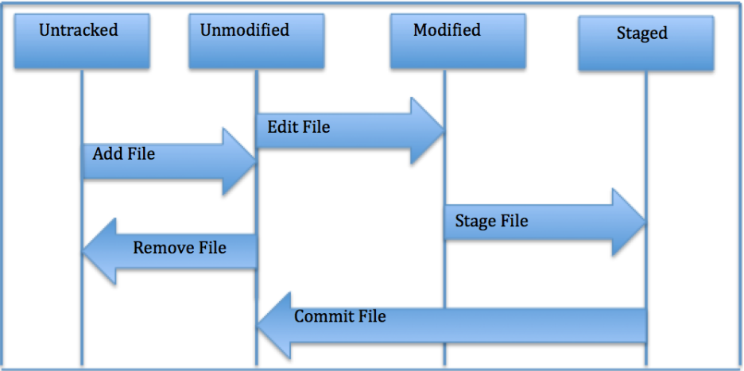

# Git 
## what is the Git : 
git is VDCS (distributed version control system) , it easy to learn and it is asystem take snapshot of the file and stores in refrence to it when you can updateing the new  version 

 Git depend mostly on local operations beacuse we can be find most all of important information without contact of network

 Git Tracking Changes  every change on the file will be found on the git ,Git will always discover file corruption or loss of information in transit
 git is designed to reduce information loss 

 Files are found in Git in 3 states : 

 1- Committed : that is mean data save on local database 

 2- modified : the file change but do not save on local datadase 

 3- Staged :Flagged a file’s changed version to be committed in the next snapshot
 
# git command 

  1- git config --global user.name" here write user name om github website  "
  
  2- git config --global user.email "write your email " 

  3- git config --list  (to check settting )      

  4-git help command ( to help you to get more information) 

  5- git add . (to add change that you did)

  6- git commit -m " " (to add some commens that is a brief explain why you are change do )

  7- git push origin main (to pushes chang from local(main) with remote repository named (origin))

  8- git status (to cheke file status)

  9- git clone url here (To clone a repository into)

  10-  git stash ( when you  are not ready to add commit and do not want loss change use `git stach` that is mean temporarily removes changes and hides and when ready to add commit use `git stash apply`)

  11- git remote ( you can view the short names such as “origin,”) 

  12-git reomte -v (you can view all the remote URLs )

  for example 

# when change on local (main) and want pushes with remote repository (origin) 
you need three steps : 

1- git add .

2-git commit -m "   " 

3-git push origin main 

# The Life Cycle of File Status 

