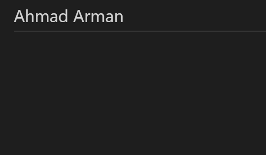

# HTML 

 HTML : Heyper text Markup Language.  Html : it help software developer to change structure  documents to help peaple in reading clearly. a word doucument help peaple to easy reading and understand clearly such as difference structure between heading ,sub heading and pargraphs. 
 
 

# structure web 

## structure web content from two main things : 

  1- Head (we have here title ,people can not see this tag, that appear in title bar )

  2- Body (we have  here shape page , people can  see every thing here)

## when start write code with Html you must know some things : 

  1- <  > that is mean start tag    
  
   2- </  >  that is mean close tag 

## look how can I write code :

 `<html>`

  `<head>`

   `<title> title bar  </title>`

  `</head> `

  `<body> `

   `<h1>title the page  </h1>`

  `
 you can write here ang thing      
`

  `</body>`

 `</html>`

## This is the Description : 
 

# HTML Version
 The html version that will use it is : HTML5,so when use HTML code you must write befor anything

  `<!DOCTYBE html>`

 That is  mean is tall browser which version html page is useing. 

# Comments Html  

  1- `<!-- here you can add comment  -->` that is mean when you want add comment to your code that will not display in user's browser 
  That will help  new devloper to understand code clearly and can add some link as email to can call with past devloper and all of thess not appear to user's browser.

  ## Example 

  `<!--start introduction -->`

  `<h1> Ahmad Arman  </h1>`

  `<!-- end introduction -->`
 
  `<!-- if you need any thing please call me , 0796780751-->` 

  `<!-- email: aa0796780751@gmail.com -->`

 ### result 

 

 2- ID Attribute 

 it use to  mark something in text as quote.

  ## Example 

 `
 ahmad arman is a succses man and he is a different he is a good man. 
`

  

 

