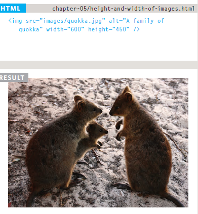
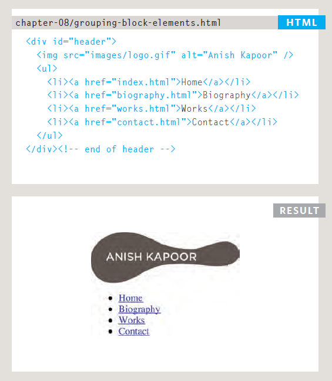

# HTML 

 HTML : Heyper text Markup Language.  Html : it help software developer to change structure  documents to help peaple in reading clearly. a word doucument help peaple to easy reading and understand clearly such as difference structure between heading ,sub heading and pargraphs. 
 
 

# structure web 

## structure web content from two main things : 

  1- Head (we have here title ,people can not see this tag, that appear in title bar )

  2- Body (we have  here shape page , people can  see every thing here)

## when start write code with Html you must know some things : 

  1- <  > that is mean start tag    
  
   2- </  >  that is mean close tag 

## look how can I write code :

 `<html>`

  `<head>`

   `<title> title bar  </title>`

  `</head> `

  `<body> `

   `<h1>title the page  </h1>`

  `
 you can write here ang thing      
`

  `</body>`

 `</html>`

## This is the Description : 
 

# HTML Version
 The html version that will use it is : HTML5,so when use HTML code you must write befor anything

  `<!DOCTYBE html>`

 That is  mean is tall browser which version html page is useing. 

# Comments Html  

  1- `<!-- here you can add comment  -->` that is mean when you want add comment to your code that will not display in user's browser 
  That will help  new devloper to understand code clearly and can add some link as email to can call with past devloper and all of thess not appear to user's browser.

  ## Example 

  `<!--start introduction -->`

  `<h1> Ahmad Arman  </h1>`

  `<!-- end introduction -->`
 
  `<!-- if you need any thing please call me , 0796780751-->` 

  `<!-- email: aa0796780751@gmail.com -->`

 ### result 

 

 2- ID Attribute 

  is used to specify a unique id for an HTML element.
  You cannot have more than one element with the same id in an HTML document.

  ## Example 

     <!DOCTYPE html>

     <html>

      <head> 
        <title> example </title>
         

      </head>

      <body>
    
        <h1 id="ahmadarman"> ahmad arman </h1>

      </body>

     <html>

### result 

  

 3- Class Attribute  
 A method for identifying multiple items
On it is different from
Other items on the page.

 

4- Block Elements 
 are the elements that will  appear to start on a new line in the browser window.
 
  Examples of block elements are : 
  
   < h1>, < p>, < ul>, and < l i>.

5- Inline Elements :

Inline elements will always appear to continue on the same line as their neighbouring elements.

 Examples of inline elements are
 
  < a>, < b>, < em>, and < img>.    

6- Grouping Text & Elements In a Block :

The < div> element allows you to group a set of elements together in one block-level box.

### Example 

7- Grouping Text & Elements Inline :

The `` element acts like
an inline equivalent of the `
`
element. It

8- `<IFrames>`:

use to Put a map on the page .that will need some element :

1- src :

 use to defined the link page to show in the frame
2- height :

use to defined the height of the iframe in pixels.

3- width :

use to defined the width of the iframe in pixels.

9-  The `< meta >` 

tag allows you to put all kinds of information about your web page

10- Escape characters are used to include special characters in your pages such as (,),<, >, and © 

# HTML5 Layout
HTML5 : is introducing a new set of elements that help define the structure of a page, The new elements provide clearer code (compared with using multiple `
` elements)

### `<header>` & `<footer>` 
 header : used element put on the top of page on the site 

 footer : used element put on the botton of page on the site  

 ### `<nav>` 
  navigation : is contain the major navigational
blocks on the site

### `<article>` 
  it is element acts can put any section of a
page such as (`<hgroub>`,`<figure>`, `<figcaption>`)

### <aside>
depending if inside `<artical>`element or out side `<artiacl>`

inside element artical : that is should contain on 
information that is related to the
article but not primary 

outside element artical :  it work as a container
for content that is related to the entire page

### `<section>` 

We should place all things under each section as appropriate

### `<hgroup>`
 it is a set of groubes that content the title`<h1><h2><hn>` 

### `<figure> <figcaption>` 
 that used to contain any content that is referenced from the main flow of an article such as : 

1- Images

2- Videos

3- Graphs

4- Diagrams

5- Code samples

The `<figure>` element should
also contain a `<figcaption>`
element which provides a text
decription for the content of
the `<figure>` element.

#  Process & Design

when we work any website we must know the important point who is the target audience? The website will be different in design according to the users

 also you must answer for question why the users are visiting your website if you have in your web site  motivations users and hit their goals will be sucsses website

Also when start desgin your website page you must to You should take care of the site map, which will greatly help your website succeed ,This image example map site 

and also we need a care about WireFrames that you can
ensure that all of the information
that needs to be on a page is
included. below image ia an example for wireframes 

 

 Also Visual hierarchy is an important to care about because  will help you to communicate with the users on the website 
 

