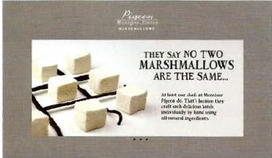
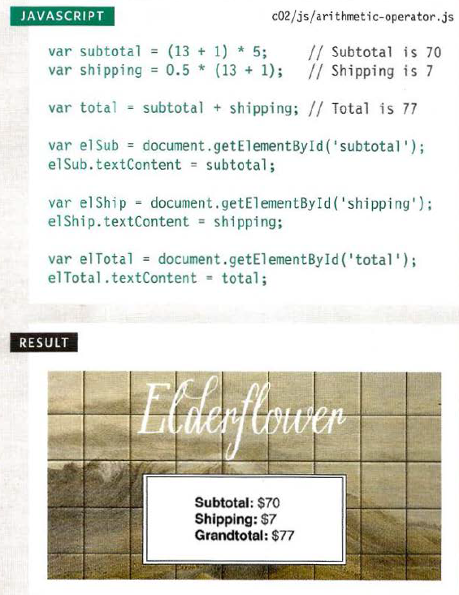
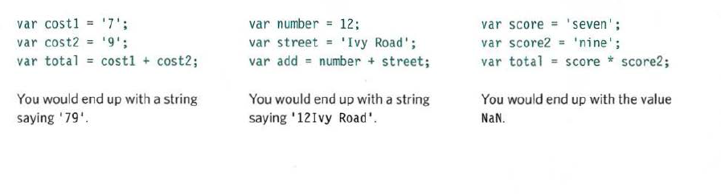
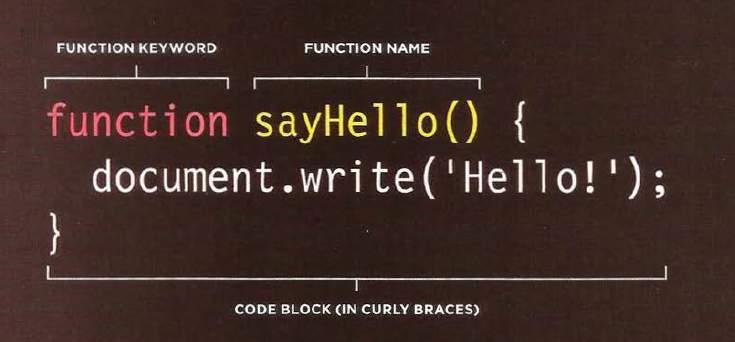
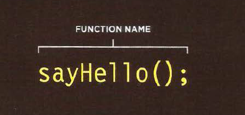
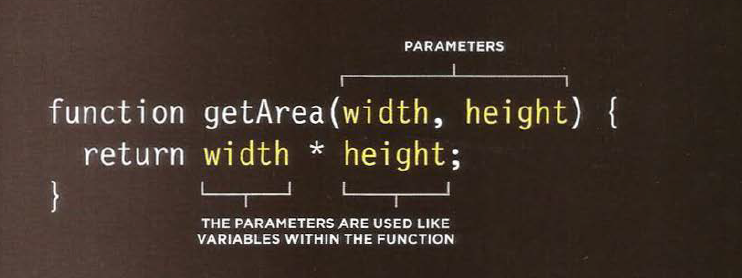

# Javascript 
 
  
 

 java script langauge is a text-based programming langauge , give web page dymanic and interactive that engage users 
 

## How javascript do interactive 
 1-access content 

  can java script to select text , element frome Html page 

2-modify content 

  can java script to remove ,add  text , element frome Html page

3- program rules  You can defined a set of steps for

the browser to follow (like a recipe )

 4-rect to event (You can defined  that a script should run

when a specific event has occurred.)

# Example 

1- Slidesshows

React : Script triggered when the page loads

Access: Get each slide from the slideshow

Modify: Only show the first slide (hide others)

Program: Set a timer: when to show next slide

Modify: Change which slide is shown

React: When user clicks button for diffe rent sl ide

Program: Determine which slide to show

Modify: Show the requested slide

 To write a script, you need to first
state your goal
 
 

##  To write a script you need 

1- defined the goak

2- desgin the script

3-code each step 

# Expression 
 ther are two type expression : 

 1-  assign a value to variable  
 var color = " blue ";

 The value of color is now bule 

 2-use two or more values to return assign a value 

 var = 2*2;

The value of area is now 4

# operators
1- assigment opertors 

Assign a value to a variable

color = 'beige';

2- arithmetic operators

Perform basic math
area = 3 * 2;

## JavaScript contains the following mathematical operators
 which you can use with numbers
You may remember some from math class 

## using aritmethic operators
The numbers do not need to be written explicitly into the code 

##  string operator
that is use for symbol without number 

 example :  
 var firstName = 'ahmad ' ;

var lastName = ' arman' ;

var ful l Name = firstName + lastName

## mix with string and number operator
if put number inside single cotation the program consist this number is string ,whitout single cotation program
consist this number is number 

# Function 
## what is the function 
  is a let of group a series of statment together to perform a specific task 

###  basic function  
we learn here how can i comray html page with javascript we have to way to do it : 

1- go to html page then go to body i will right code script in end of body like this 

``

and in link page app.js/lab04.js can work and write every function thire .

2- can write the code script in body inside script tag like this 

    `

### declaring a function : 
 you give  it a name and then write the statment need  

 

### calling a function : 
you can then excute all of statement between its cury braces with just one line code 

### declaring function that need information 
 sometime a function needs information to perform its task 

 

