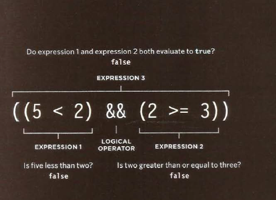
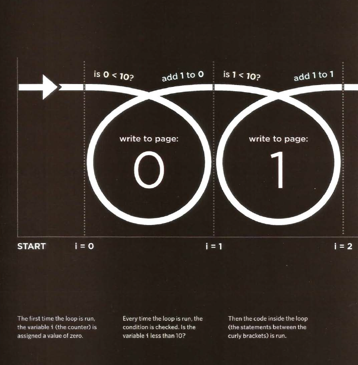
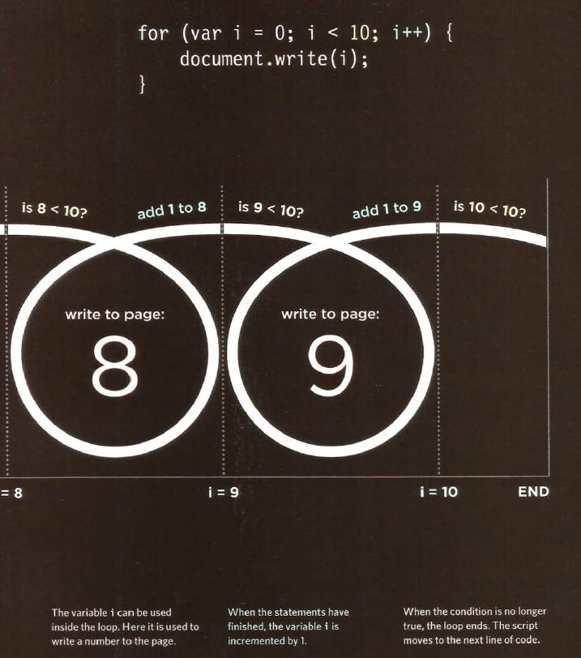
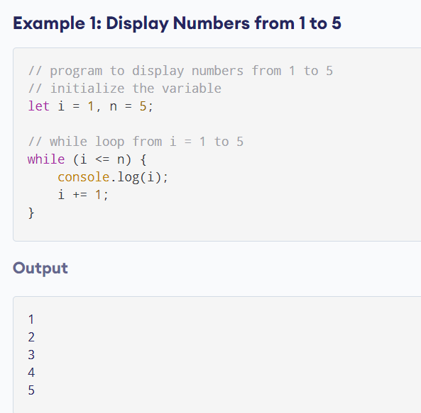

# comparison operator 
## evaluating condition 
you can estimate a situation by comparing script to what you expect the result should be true or flase 
# Example 
1- `==`  equal to 

that is mean equal to operator two values (string,number or boolean )

`'ahmad' == 'mohmmad'` result false beacuse ther are not same string , but for butter use this 

2- `===` script equal to 

This operator compares two value that check data tybe and value 

`'3'===3` result false beacuse ther are not the same data tybe or value 

3- `!=` is not equal to 

This operator compares two values (number, string , boolean)

`'ahmad' != 'mohmmad' ` result true 

`'ahmad' != 'ahmad' ` result false  

 but for butter use this 

 4- `!==` 

 This operator compares two value that check data tybe and value 

`'3'!===3` result true beacuse ther are not the same data tybe or value 

5- `> ` greater than  

This operator to check the number on the left is greater than number on the right 

`4>3` True 

`3>5` False 

6- `<` less than 

This operator to check the number on the left is less than number on the right 

`3<5` true

`4<3` Flase 

7- `<=` less than or equal

This operator to check the number on the left is less than or equal number on the right 

`3<=5` true

`4<=3` Flase 

8- `>= ` greater than or equal 

This operator to check the number on the left is greater than or equal number on the right 

`4>=3` True 

`3>=5` False 

# logical operators 
that allow you to compare result of more than one comparison operator 

## Example 
1- && logical and 

This operator more than one condition 

`((2<5) && (3>2)`

`  T && T result T `

`  T && F result F `

`  F && F result F `

2- || logical or 

This operator at least one condition 

`((2<5) || (3>2)` 

`  T || T result T `

`  T || F result T `

`  F || F result F `

3- ! logical not 

This operator single boolean value and inverst it 

`!(2<1>) result T` 

`!T result F`

`!F result T`

# LOOPS 
JavaScript loops are used to repeatedly run a block of code - until a certain condition is met. When developers talk about iteration or iterating over, say, an array, it is the same as looping. JavaScript offers several options to repeatedly run a block of code, including while, do while, for and for-in. 

## type of loops 

1- `for loops` 

if you need to run code aspecific number of time use for , usually a counter  which is used to tell how many time the loop shuold run . 

 we have three steps 

 1- initialization : great a variable and set it to 0 and it acts as the counter 

 2- condition : the loop should countiue until the counter reaches aspecified number 

 3- ubdate : every time the loop has run it adds one to the counter 

 

 

2-  `while loops`

 The while statement creates a loop that is executed while a specified condition is true. The loop will continue to run as long as the condition is true. It will only stop when the condition becomes false. ... do/while - loops through a block of code once, and then repeats the loop while a specified condition is true

  

 
