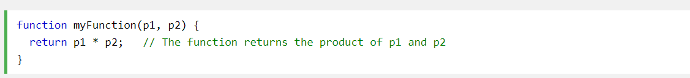
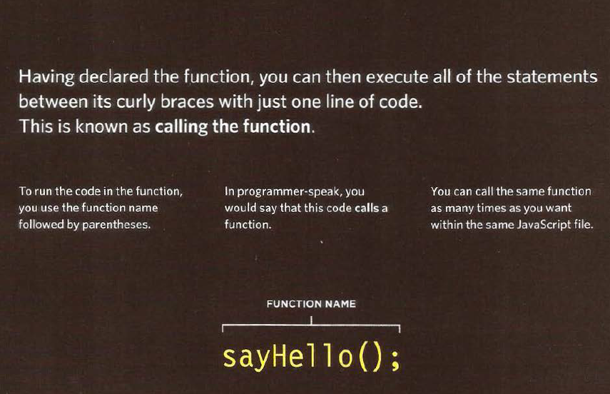
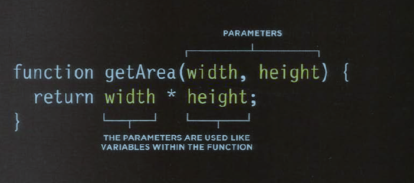
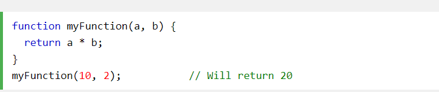
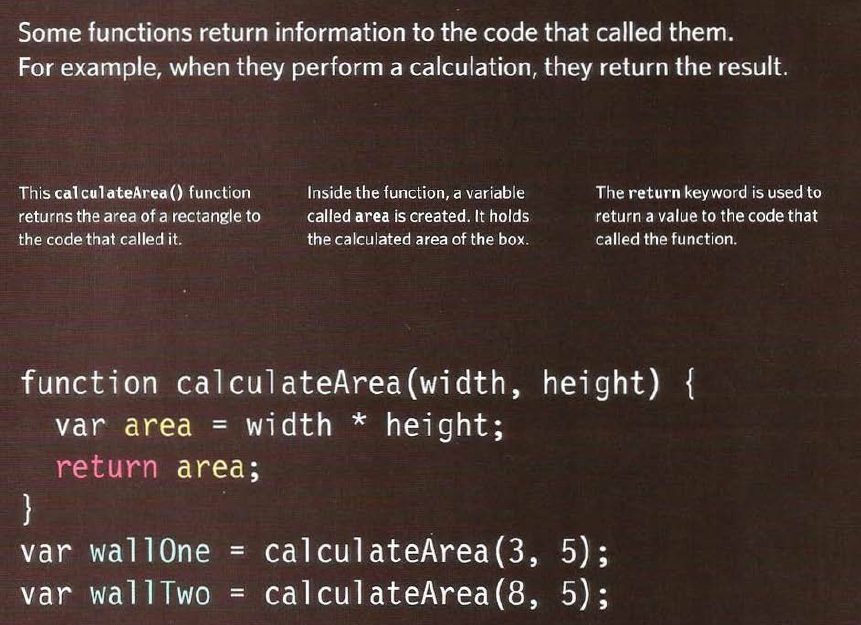

# Function 

 is similar to a procedure a set of statements that performs a task or calculates a value, but for a procedure to qualify as a function, it should take some input and return an output where there is some obvious relationship between the input and the output. To use a function, you must define it somewhere in the scope from which you wish to call it.

## A BASIC FUNCTION 
 

## declaring a function 

## Invoking a JavaScript Function
The code inside a function is not executed when the function is defined.

The code inside a function is executed when the function is invoked.

It is common to use the term "call a function" instead of "invoke a function".

## declaring a function that need information 

some function taht need some information like parameter ,
parameter act like a variables 

## for example 

## calling a function that need information 
when calling the function we need some information inside to enable the function work 

## for example 

## getting a single value out of function 

